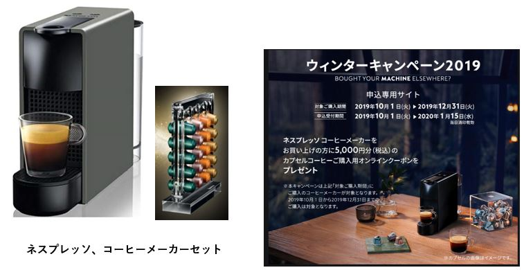
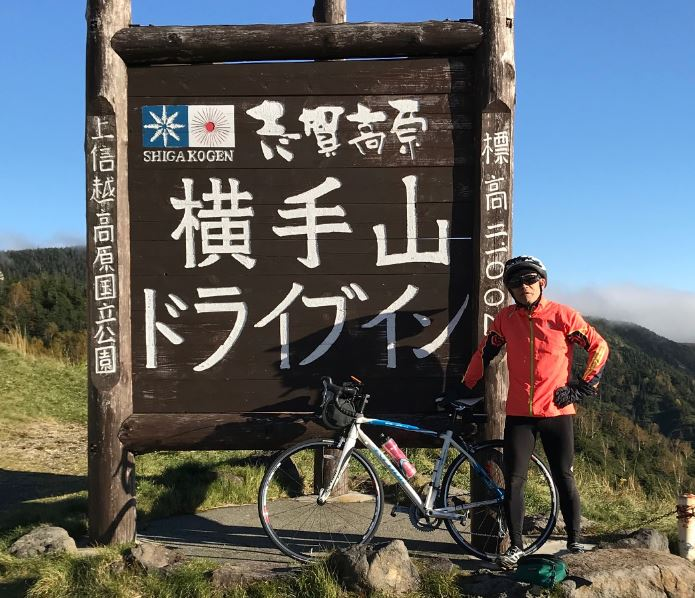
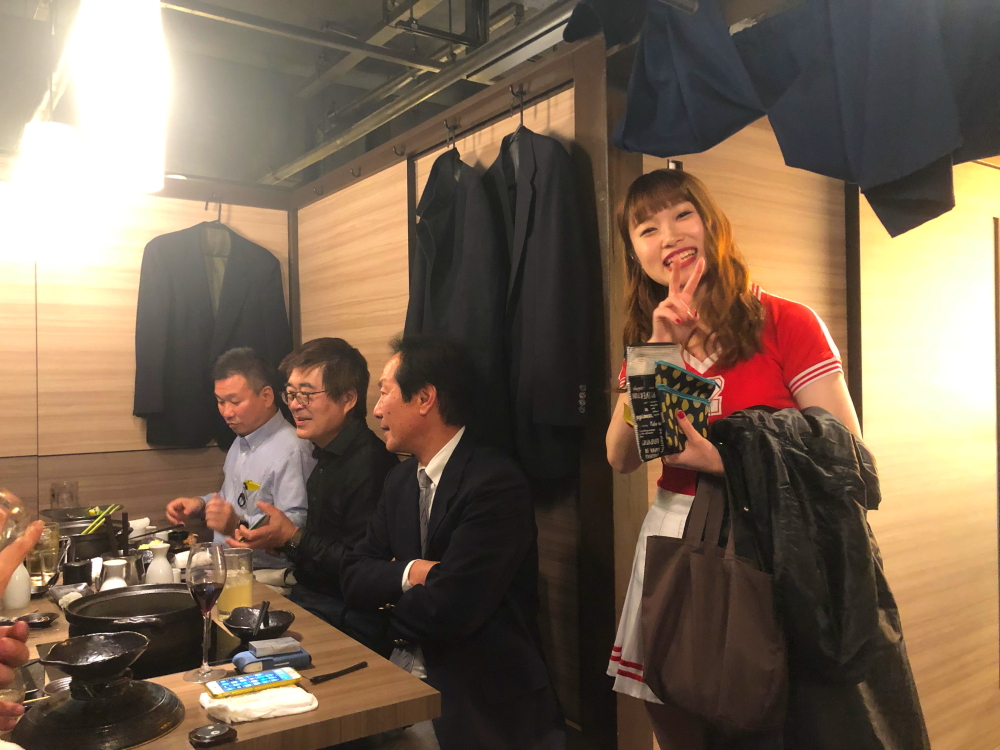
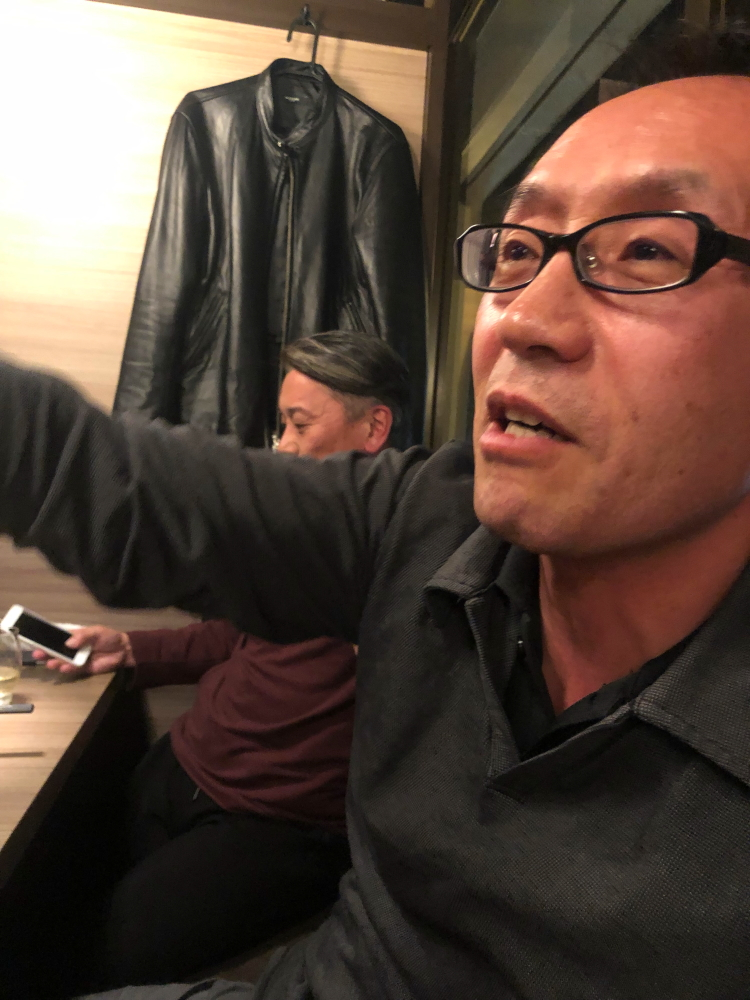
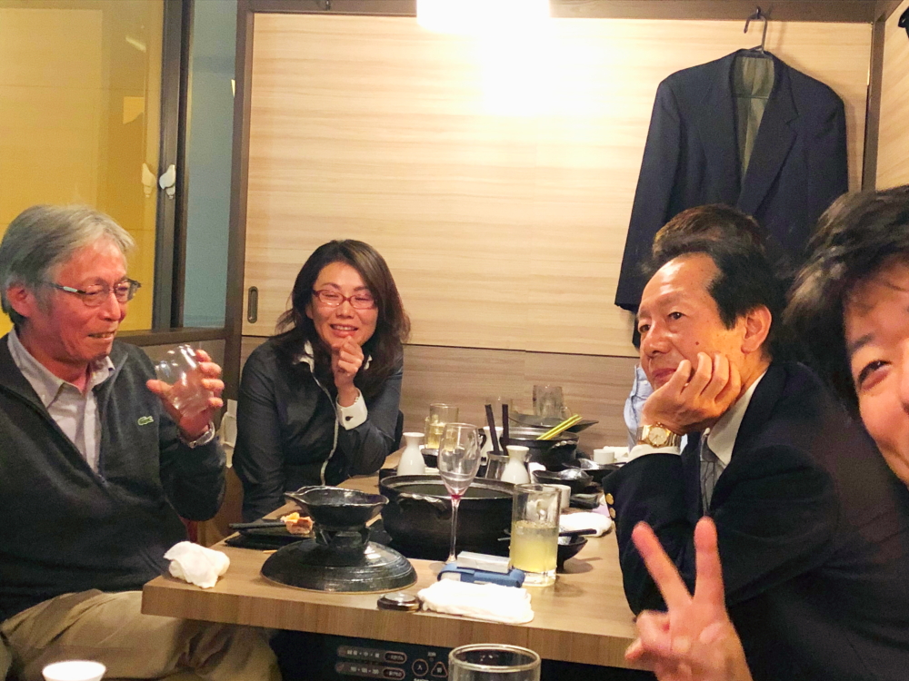
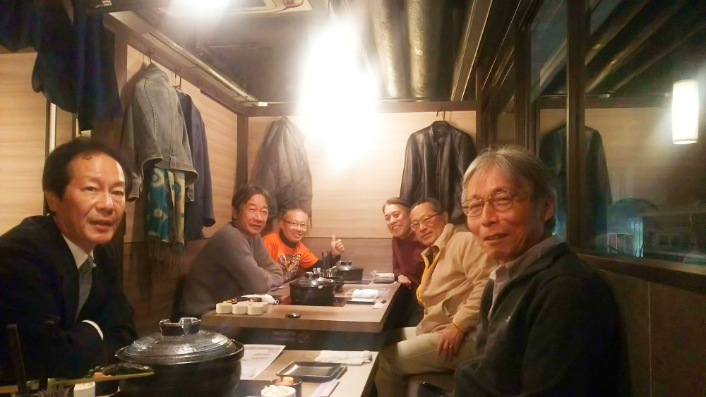
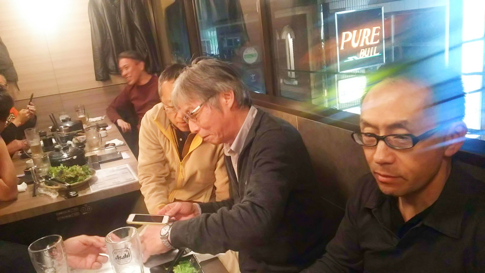
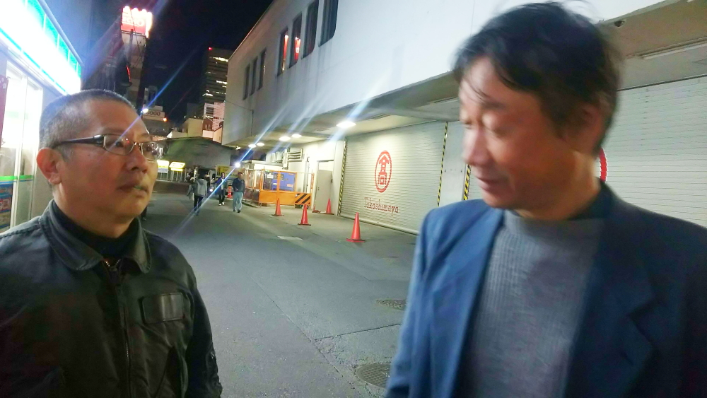

# fts_furuhashi

<html lang="ja">
 <head>
  <meta charset="utf-8" />
	 

<link href="https://cdnjs.cloudflare.com/ajax/libs/lightbox2/2.7.1/css/lightbox.css" rel="stylesheet">
 
</head>
<body>

  モバイル端末をお使いの場合は、画面を横向きにすると
  より見やすくご覧頂けます。

	
<h1><strong>簡易、支払い＆精算計算</strong></h1>

        
<section>

<ul>
<li> <input type="button" id="btn1" value="精算計算  " onclick="btn1Click();" /> 　←　支払い＆精算計算、開始ボタン</li>
</ul>
    

    
        </section>
                         

<!--
<h1><marquee behavior="left">!!! 2020年1月24日(土)に元FTS伊藤さん、矢口さん、小林実さんのご卒業記念バーティー@魚盛 大宮店、が執り行われました !!!</marquee></h1>
<h2>記念品目録</h2> 
<h3>for 伊藤さん</h3>

<h3>for 矢口さん</h3>

<h3>for 小林実さん</h3>

<h3>実さん近況</h3>

     

-->

<h1><marquee behavior="alternate">!!! 2019年4月17日(水)に元FTS伊藤さんのご卒業記念お食事会が執り行われました !!!</marquee></h1>

     
<h1><marquee behavior="alternate">!!! 2018年11月15日(木)に元FTS古橋さんのご卒業記念パーティーが執り行われました !!!</marquee></h1>

<marquee direction="right" scrollamount="20" width="30%">(^_^)/~hada</marquee>

                             

<h3>↓ 画像はクリックで拡大します。スライドショーで閲覧できます。</h3>

<h4>↑パノラマ・マジックで、少し歪んじゃった人が居たりしますが、ご愛敬〜〜(^_^)v。</h4> 
<h4>ここからは加藤さん撮影分。</h4> 

<h4>ここからは雅代さん撮影分。</h4> 

 

<h1>     <strong>動画リンク集</strong></h1>
 <h3>

横山さん、古橋さんのお言葉 
<iframe width="560" height="315" src="https://www.youtube.com/embed/W5K0uA5AadE" frameborder="0" allow="accelerometer; autoplay; encrypted-media; gyroscope; picture-in-picture" allowfullscreen></iframe>
<iframe width="560" height="315" src="https://www.youtube.com/embed/rfUiO9g_3ug" frameborder="0" allow="accelerometer; autoplay; encrypted-media; gyroscope; picture-in-picture" allowfullscreen></iframe>
	
</h3>

  
<main>
<h3>・・・開催通知・・・</h3> 
★★★★★★★★★★★★★★★★★★★★★★★★★★★★★★★★★★★★ 
From: Masayo Arai (荒井 雅代)  
Sent: Wednesday, October 31, 2018 11:17 AM 
To: Minoru Kobayashi (小林 実) <minoru_kobayashi@n.t.rd.honda.co.jp>; Yutaka Kamata (鎌田 豊) <Yutaka_Kamata@n.t.rd.honda.co.jp>; Hidehiko Anzai (安齊 秀彦) <hidehiko_anzai@n.t.rd.honda.co.jp>; Masashi Manita (間仁田 雅司) <masashi_manita@n.t.rd.honda.co.jp>; Yasuhiro Sakashita (坂下 泰広) <yasuhiro_sakashita@n.w.rd.honda.co.jp>; Yuji Saito (斉藤 祐司) <yuji_saito@n.w.rd.honda.co.jp>; '0nh75b05325615n@ezweb.ne.jp'; Toshio Yokoyama (横山 利夫) <Toshio_Yokoyama@n.t.rd.honda.co.jp>; Tadahiro Yaguchi (矢口 忠博) <tadahiro_yaguchi@n.w.rd.honda.co.jp>; JUN TOMIZAWA (冨沢 潤) <Jun_A_Tomizawa@hm.honda.co.jp>; Naomi Ito (伊東 尚美) <naomi_ito@n.w.rd.honda.co.jp>
Cc: Takero Shibukawa (澁川 岳郎) <takero_shibukawa@n.w.rd.honda.co.jp>; Shuichi Kato (加藤 秀一) <shuichi.kato@mail.a.rd.honda.co.jp>; Satoshi Hada (羽田 智) <satoshi_hada@n.t.rd.honda.co.jp> 
Subject: 【場所決定】　FTS：古橋さんご卒業会 
  
旧未来交通システム研究室の皆様 
（返信メールいただいた方のみのご連絡） 
  
お世話様です。 
以下の日程で古橋さんご卒業会を開催いたします。 
改めて出席者の確認をしたいと思います。 
変更される方はご連絡ください 
期日：11月5日（月）まで 
  
日時：11月15日（木）19:00～22:00 
場所：個室和食 傳～DEN～ 大宮店 
　　　埼玉県さいたま市大宮区仲町2-43-1 COMO大宮ビル3F 
　　　　https://r.gnavi.co.jp/d51a1y3d0000/menu7/ 
内容：5500円コース　3時間飲み放題付 
予約名：渋川  
 
＜出席者＞　ご連絡いただいた順 
１．村田さん 
２．加藤さん 
３．(間仁田さん) 
４．斉藤さん 
５．横山さん 
６．小林さん 
７．安斉さん 
８．羽田さん 
９．(坂下さん) 
１０．渋川さん 
１１．矢口さん 
１２．(冨沢さん) 
１３．古橋さん（主賓） 
１４．荒井 
  
コース料理を注文いたします。 
キャンセル料が発生することございます。 
ご了承ください。 
  
  
また、今回、記念品を用意しようと考えております。 
お勧めのお品ものございましたらご連絡ください。 
  
  
幹事長：渋川隊長 
幹事：加藤さん、羽田さん（HGT取りまとめ）、荒井 
  
  
★★★★★★★★★★★★★★★★★★★★★★★★★★★★★★★★★★★★★★★★★★★★★★★★★ 
　 
荒井　雅代 
株式会社 本田技術研究所　R&DセンターＸ 
 
〒351-0188　埼玉県和光市本町8-1 
外線：080-4789-8853　内線：8705148 
FAX:048-462-5106 
E-mail:masayo_arai@n.w.rd.honda.co.jp 
 
★★★★★★★★★★★★★★★★★★★★★★★★★★★★★★★★★★★★★★★★★★★★★★★★★ 
</main>

      
<section>
<h3>・・・古橋さん、ご挨拶メール。・・・</h3> 

Seiichi Furuhashi (古橋 清一) globalhonda.onmicrosoft.com 経由 
12月19日(水) 15:35 (1 日前) 

To Toshio, Masayo, 自分, Hidehiko, Satoshi, Minoru, Shuichi, Tadahiro, Takero, Yuji, Yutaka, Seiichi  

旧FTSの皆さん  
 
先日の大宮での卒業式有り難うございました。 
久しぶりに皆様にお会いでき、楽しいひと時を過ごすことができました。  
 
本日をもちまして、31年間勤めてきたHONDAを定年退職します。 
31年間、楽しく、充実したHONDA人生でした。 
特に、多種多様なキャラクターが終結したFTSは大変印象深く残っています。  
 
飲んだ後の寝過ごしには充分気をつけて、 
健康に留意しこれからも頑張って下さい。皆様の活躍を祈っています。  
 
退職後の連絡先ですが、 
携帯：080-9200-1289 
携帯アドレス：seiichi_furuhashi@docomo.ne.jp 
となります。  
 
よろしくお願い致します。   

 
古橋 

</section>

      
<main>
<h3>・・・開催翌週のメール会話が面白かったので記録しました。・・・</h3> 
	
 
	
From: torokoid Mibu [mailto:torokoid@gmail.com]  
Sent: Wednesday, November 21, 2018 10:22 PM 
Subject: Re: 【ご連絡】　FTS：古橋さんご卒業会 

雅代さん撮影ぶんも追加しました。 

https://torokoid.github.io/fts_furuhashi/ 

その他写真も随時受付中です〜😉😂 

羽田 

2018年11月20日(火) 21:52 torokoid Mibu <torokoid@gmail.com>: 

とりあえず、加藤さん撮影分の写真をHPに追加しました。 

追加写真も随時受付中〜😉 

https://torokoid.github.io/fts_furuhashi/ 

羽田 

   

2018年11月20日(火) 10:18 Masayo Arai (荒井 雅代) <masayo_arai@n.w.rd.honda.co.jp>: 

■小林さん　 

那須塩原で3人いたとは・・・ 

確かに宇都宮どまりの電車は安全ですね。 

お財布すられていないですか？本当に気をつけてくださいねーー 

■横山さん 

横山さんは紳士的なので（女性だけ？） 

小林さんを置き去りにするなんて信じられないと思っていました。 

ちゃんとお声がけしてくださったのですね。 

でも次は、小林さんをしっかり保護してあげてくださいねー。 

■古橋さん 

素直に私と武蔵野線経由で帰ればよかったのにーーー。 

そうしたら12時前には帰宅できましたよ。 

皆さんのメールを読みながら笑ってしまいました。 

先日の飲み会は、本当に楽しい飲み会でした！ 

荒井雅代 

   

From: torokoid Mibu [mailto:torokoid@gmail.com]  
Sent: Monday, November 19, 2018 10:28 PM 
Subject: Re: 【ご連絡】　FTS：古橋さんご卒業会 

みなさま、お疲れ様です！ 

羽田は新幹線の速度では危険なので、宇都宮止まりの快速で無事帰り着きました。 

宇都宮から岡本までは、奥様タクシーでした〜😂 

HPの方は、写真が集まってきたら、また更新して再配信しますのでお楽しみに。 

   

2018年11月19日(月) 20:55 Seiichi Furuhashi (古橋 清一) <seiichi_furuhashi@n.w.rd.honda.co.jp>: 

今日は実家のガスコンロが故障し、交換の為有休でした。  

小林さんの寝過しで盛り上がってますが、 実は私も気付いたら武蔵小杉でした。時間は11時20分。次の上りは11時40分千葉行き。 

乗換案内で調べたら、東横線の武蔵小杉経由で家までたどり着けそうなので、10分歩いて東急武蔵小杉まで行ったら、今度は人身事故で自由が丘〜渋谷間が不通。 

でも乗るしかなくて、途中の停車駅、多分多摩川か田園調布で、反対ホームにたまたま目黒行きが来たのでそれに飛び乗って、何とか山手線経由で、西武池袋線の最終電

車に間に合いました。家にたどり着いたのは1時過ぎてましたが、ホットしました。 

武蔵小杉のタワーマンション群は、新幹線からいつも眺めてましたが、身近で初めて見ました。いい経験でした。 

ちなみに、大宮で乗った湘南新宿ライナーは国府津行きだったので、本当に途中で気付いて良かったです。 

皆様、飲んで電車で帰るときは、同方向の人と一緒に帰りましょう。一人のときは、空いていても、立っていれば寝過しません。 

古橋 

 iPhoneから送信 
 
    

2018/11/19 19:18、Minoru Kobayashi (小林 実) <minoru_kobayashi@n.t.rd.honda.co.jp>のメール: 

横山さん 

帰りは終点が宇都宮のローカルを使うのが100%安全なので、次回はそうしたいと思います 

加藤さん 

N-VANですか？　何か食材でも仕入れにいくみたいでいいですね 

そろそろ不具合は収まっている頃だと思います 

小林 

   

From: Toshio Yokoyama (横山 利夫)  
Sent: Monday, November 19, 2018 7:07 PM 
Subject: RE: 【ご連絡】　FTS：古橋さんご卒業会 

小林さん 

横山＠本田技術研究所です。 
いつも色々とお世話になっております。 

確かにホームで遭遇して、私は小林さんに断わってからトイレの近くの車両に乗車しました。 

小林さんは、ホーム上で既に千鳥足だったので、今思えば近くに席に座っていればよかったかも 

しれません。次回は一緒に帰りましょう。 

ちなみに、横山は普通に宇都宮で降りました。 

 ------------------------------------------------------ 

横山　利夫 

(株）本田技術研究所　四輪R&Dセンター 

統合制御開発室 

上席研究員(特任） 

〒321-3393 

栃木県芳賀郡芳賀町下高根沢4630番地 

Mobile: 090-8804-2188 

Mail: toshio_yokoyama@n.t.rd.honda.co.jp 

横山不在時には、 

吉葉 由美さん(028)677 3377(内）8767296 

Mail: yumi_yoshiba@n.t.rd.honda.co.jp 

まで連絡の程、宜しくお願い申し上げます。 

------------------------------------------------------ 

   

From: Shuichi Kato (加藤 秀一)  
Sent: Monday, November 19, 2018 6:55 PM 
To: Minoru Kobayashi (小林 実)  
Subject: RE: 【ご連絡】　FTS：古橋さんご卒業会 
 
小林さん 
お疲れ様です。 
たいへんですね。普段からちゃんと寝てくださいね。 
N-VAN納車が今週末です。 
調子悪くなったら、小林さんに直接相談すれば良かったんでしたっけ？ 
 
加藤（8724421）@HGAデザイン1BL 

   

From: Minoru Kobayashi (小林 実)  
Sent: Monday, November 19, 2018 6:47 PM 
Subject: RE: 【ご連絡】　FTS：古橋さんご卒業会  

ホームで横山さんと会った気がしましたが、乗ったときは一人になっていて 

アラームセット前に眠り込んでしまいました 

ちなみに、那須塩原駅には３人の同じ境遇の人がいました 

   

From: Masayo Arai (荒井 雅代)  
Sent: Monday, November 19, 2018 6:37 PM 
Subject: RE: 【ご連絡】　FTS：古橋さんご卒業会 

え？ 

誰も起こしてくれなかったのですか？？？？ 

From: Minoru Kobayashi (小林 実)  
Sent: Monday, November 19, 2018 6:09 PM 
Subject: RE: 【ご連絡】　FTS：古橋さんご卒業会 

雅代さん 

会計と写真お疲れ様です 

私は、あの後、那須塩原～という声で目が覚めて、いたい目にあいました 

小林 

   

From: Masayo Arai (荒井 雅代)  
Sent: Monday, November 19, 2018 2:50 PM 
Subject: 【ご連絡】　FTS：古橋さんご卒業会  

古橋さん 

お世話様です。 

15日の写真を羽田さんが以下の場所にまとめてくれましたので 

ご連絡します。 

後、ワインが届きましたので、お席に持って行きますね。 

荒井雅代 

＊＊＊＊＊ 

   

みなさま 

昨晩は楽しい送別会をありがとうございました。 

手持ちの写真でHPを暫定構成してみました。 

https://torokoid.github.io/fts_furuhashi/ 

お手元の写真を共有いただければ、HPに追加しますので、ご連絡下さい。 

羽田 
</main>
                  	
	
	

              

 

<!-- フッタ -->
 <footer>
 Copyright 2018/11/16 S.Hada
	</footer>
